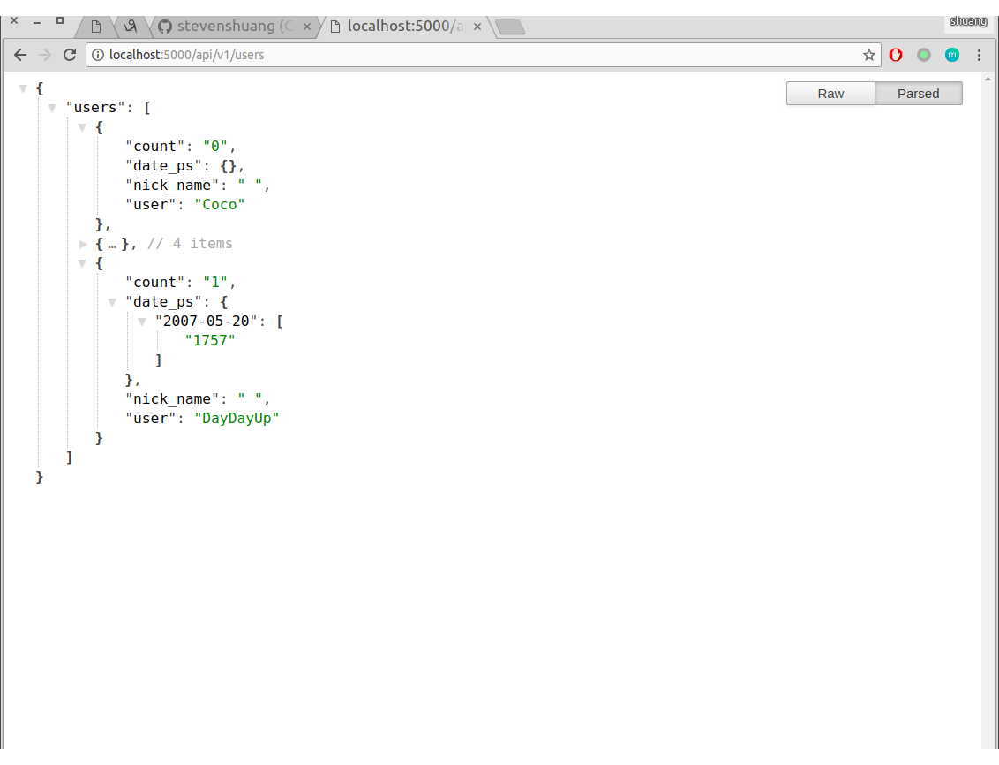

# SutAcm训练记录平台

## 主要参考
> [《Flask Web开发 基于Python的Web应用开发实战》](https://www.nyloner.cn/static/files/Flask%20Web%E5%BC%80%E5%8F%91%EF%BC%9A%E5%9F%BA%E4%BA%8EPython%E7%9A%84Web%E5%BA%94%E7%94%A8%E5%BC%80%E5%8F%91%E5%AE%9E%E6%88%98.pdf)

## 主要目的
> 用来记录训练队员的每周的做题情况, 监督学习

## 主要功能
* 一表格的形式, 直观的显示做题情况
* 仿github的contributions做了做题的时间分布

## 爬虫数据请见[hdoj爬虫](https://github.com/stevenshuang/spider/tree/master/hdoj)

## 使用
1. sudo python3 -m pip install pipenv
2. git clone https://github.com/stevenshuang/SutAcmDRA.git
3. 进入根目录, pipenv install 
4. 配置config的数据库密码
5. 尝试测试 python3 manage.py runserver
6. 后续会完成docker一键部署

## 截图
* 

## 有建议, 问题或者想法欢迎issue, PR
